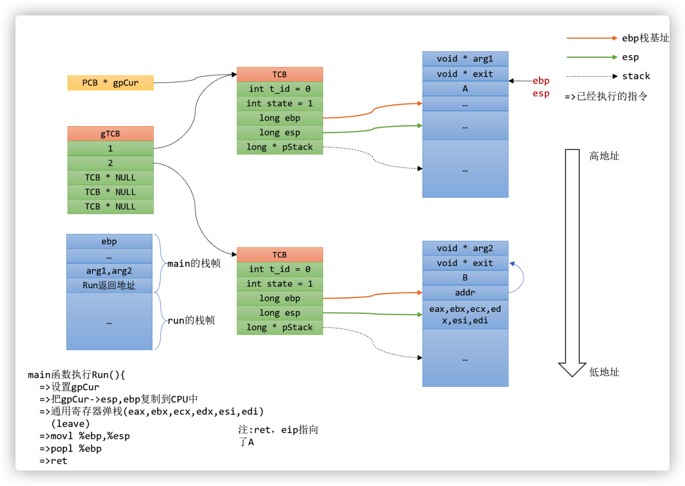

# 1. 课程设计任务、要求、目的

## 1.1 课程设计任务

 依据操作系统课程所介绍的线程知识，实现一个用户级线程库。

## 1.2 课程设计目的和要求

- 建立用户级线程库
- 至少包括线程的创建、撤销、状态转换等，以及线程切换
- 库写好后，构建一个程序，演示线程库的使用

# 2. 开发环境

Visual Studio 2022

# 3. 相关原理及算法

有关线程管理的所有工作都由应用程序完成，内核意识不到线程的存在. 应用程序可以通过使用线程库设计成多线程程序. 通常，应用程序从单线程起始，在该线程中开始运行，在其运行的任何时刻，可以通过调用线程库中的派生例程创建一个在相同进程中运行的新线程。

用户级线程仅存在于用户空间中，此类线程的创建、撤销、线程之间的同步与通信功能，都无须利用系统调用来实现。用户进程利用线程库来控制用户线程。由于线程在进程内切换的规则远比进程调度和切换的规则简单，不需要用户态/核心态切换，所以切换速度快。由于这里的处理器时间片分配是以进程为基本单位，所以每个线程执行的时间相对减少为了在操作系统中加入线程支持，采用了在用户空间增加运行库来实现线程，这些运行库被称为「线程包」，用户线程是不能被操作系统所感知的。用户线程多见于一些历史悠久的操作系统，例如Unix操作系统

用户级线程驻留在用户空间或模式。运行时库管理这些线程，它也位于用户空间。它们对于操作系统是不可见的，因此无法被调度到处理器内核。每个线程并不具有自身的线程上下文。因此，就线程的同时执行而言，任意给定时刻每个进程只能够有一个线程在运行，而且只有一个处理器内核会被分配给该进程。对于一个进程，可能有成千上万个用户级线程，但是它们对系统资源没有影响。运行时库调度并分派这些线程。

实现方式如下：


如同在图中看到的那样，库调度器从进程的多个线程中选择一个线程，然后该线程和该进程允许的一个内核线程关联起来。内核线程将被操作系统调度器指派到处理器内核。用户级线程是一种「多对一」的线程映射

『**用户级线程的优点**』

- 可以在不支持线程的操作系统中实现。

- 创建和销毁线程、线程切换代价等线程管理的代价比内核线程少得多, 因为保存线程状态的过程和调用程序都只是本地过程

- 允许每个进程定制自己的调度算法，线程管理比较灵活。这就是必须自己写管理程序，与内核线程的区别

- 线程能够利用的表空间和堆栈空间比内核级线程多

- 不需要陷阱，不需要上下文切换，也不需要对内存高速缓存进行刷新，使得线程调用非常快捷

- 线程的调度不需要内核直接参与，控制简单

**『用户级线程的缺点』**

- 线程发生I/O或页面故障引起的阻塞时，如果调用阻塞系统调用则内核由于不知道有多线程的存在，而会阻塞整个进程从而阻塞所有线程, 因此同一进程中只能同时有一个线程在运行

- 页面失效也会产生类似的问题

- 一个单独的进程内部，没有时钟中断，所以不可能用轮转调度的方式调度线程

- 资源调度按照进程进行，多个处理机下，同一个进程中的线程只能在同一个处理机下分时复用

# 4. 系统结构和主要的算法设计思路

实现的核心为线程的创建和调度，具体流程如下：





# 5. 程序实现---主要数据结构

描述所设计系统的关键数据结构。
## task_struct

位于`uthread.h`中，相当于线程结构体TCB

### 属性

- uint32_t* self_stack
  
  指向线程自己的栈
  
- enum task_status status
  
  线程的状态
  
- char name[16]
  
  线程的名字
  
- uint32_t elapsed_ticks
  
  已经在cpu上运行的ticks
  
- struct list_elem general_tag
  
  在一般线程队列中的结点
  
- struct list_elem all_list_tag
  
  在总队列中的结点
  
- uint32_t stack_magic
  
  结构体的末尾的魔数 检测栈的溢出
  

## semaphore

信号量

### 属性

- uint8_t value
  
  信号量的值
  
- struct list waiters
  
  在信号量上等待的线程
  

## lock

### 属性

- struct task_struct* owner
  
  锁的所有者
  
- struct semaphore* sema
  
  锁持有的信号量
  
- uint32_t count
  
  请求锁的次数，保证可重入
  


# 6. 程序实现---主要程序清单

## switch_to 函数实现线程切换
``` c
switch_to(struct task_struct cur,struct task_struct next);
```
### 线程切换函数switch_to的实现
#### 上下文的保存与恢复

call指令在跳转前将当前指令的下一条指令压入栈中

cdecl 调用者将所有参数从右往左压入栈中并且调用者清理参数所占的空间

那么结合这两条规则很容易得出，在c语言调用函数后，用户栈中的内容将会是


根据abi调用协定，函数调用**ebp、 ebx, edi、 esi、和 esp 归主调函数所用**，其余的寄存器归被调函数所用​。对于线程的调度来说本质上是函数之间的切换，也就是说，只用保证在线程切换回来之后，ebp ebx edi esi esp​这5个寄存器保持不变，就能够保证程序的正常运行

因此，在切换程序开始时首先执行

```nasm
 push esi
 push edi
 push ebx
 push ebp
```

将这四个寄存器保存在原线程的栈中

接着将esp保存在线程结构体中

线程结构体是switch_to函数的第一个参数

也就是esp加上ebp ebx edi esi和返回地址

也就是4*5 = 20

将其保存到线程结构体的首地址也就意味着将esp保存到了线程结构体的第一个数据成员中

```nasm
   mov eax, [esp + 20]
   mov [eax], esp  
```

恢复环境是保存环境的逆过程

#### 线程的切换

CPU执行ret指令时，相当于执行了以下两步操作

1. (IP) = ((ss)*16 +(sp))
  
2. (sp) = (sp)+2
  

​在恢复了环境之后，栈顶就相当于下一个线程上次调度的地方，也就是ret的返回地址，在此处执行ret就能够完成线程的切换

```nasm
ret
```


# 7. 程序运行的主要界面和结果截图

列出系统运行的主要界面和运行结果截图。


# 8. 总结和感想体会

在本次的OS课程设计中，我最大的收获是加深了对线程的理解。我明白了线程是在一个地址空间下启动并交替执行的程序，用户级线程用用户管理。在用户级线程中，有关线程管理的所有工作都由应用程序完成，内核意识不到线程的存在. 应用程序可以通过使用线程库设计成多线程程序. 通常，应用程序从单线程起始，在该线程中开始运行，在其运行的任何时刻，可以通过调用线程库中的派生例程创建一个在相同进程中运行的新线程。

我还学到了用户级线程仅存在于用户空间中，此类线程的创建、撤销、线程之间的同步与通信功能，都无须利用系统调用来实现。用户进程利用线程库来控制用户线程。由于线程在进程内切换的规则远比进程调度和切换的规则简单，不需要用户态/核心态切换，所以切换速度快。由于这里的处理器时间片分配是以进程为基本单位，所以每个线程执行的时间相对减少为了在操作系统中加入线程支持，采用了在用户空间增加运行库来实现线程，这些运行库被称为“线程包”，用户线程是不能被操作系统所感知的。用户线程多见于一些历史悠久的操作系统，例如Unix操作系统

而且因为用户级线程驻留在用户空间或模式。运行时库管理这些线程，它也位于用户空间。它们对于操作系统是不可见的，因此无法被调度到处理器内核。每个线程并不具有自身的线程上下文。因此，就线程的同时执行而言，任意给定时刻每个进程只能够有一个线程在运行，而且只有一个处理器内核会被分配给该进程。对于一个进程，可能有成千上万个用户级线程，但是它们对系统资源没有影响。运行时库调度并分派这些线程。

在进行课程设计时，我对线程相关的知识进行了更深入的学习，学到了很多，同时也收获了很多。我惊叹于OS的魅力，感受到了OS这门课的乐趣。在今后的工作生活中，我一定更加努力学习OS相关知识，为国家和社会贡献一份属于自己的力量！

# 参考文献

无

# 附录

无

 
